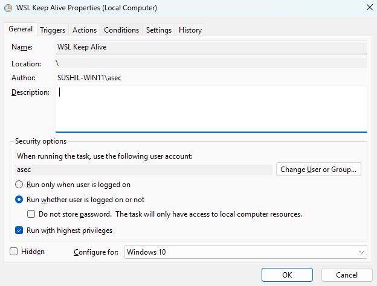

# WSL Auto Start & Keep-Alive Setup

This guide explains how to automatically start **WSL (Ubuntu)** on Windows startup and keep it alive for background services.

---

## 1. Set WSL Defaults

Run these commands **once** in PowerShell or Command Prompt:

```powershell
# View the list of wsl
wsl --list --verbose
# View available wsl
wsl --list --online
#Install Distro and restart terminal once
wsl --install -d Ubuntu-22.04 or wsl --install -d Ubuntu
# Set default distro
wsl.exe --set-default Ubuntu
wsl.exe --set-default-version 2
```

- `--set-default Ubuntu` → sets **Ubuntu** as your default distro  
- `--set-default-version 2` → ensures all new distros use **WSL2** by default

---

## 2. Start WSL on Boot (Keep Alive)

To start WSL automatically and keep it running in the background, use Task Scheduler with this command:

```powershell
wsl.exe -d Ubuntu -- true
```

- `-d Ubuntu` → starts the Ubuntu distro  
- `-- true` → runs a dummy command that immediately exits but **keeps WSL alive** in the background

---

## 3. Start WSL + Services Automatically

If you want services like PostgreSQL or Redis to run when Windows boots, use:

```powershell
wsl.exe -d Ubuntu -u root sh -c "service postgresql start && tail -f /dev/null"
```

- `-u root` → runs as the root user  
- `service postgresql start` → starts PostgreSQL  
- `tail -f /dev/null` → keeps WSL running forever  

For multiple services, chain them:

```powershell
wsl.exe -d Ubuntu -u root sh -c "service postgresql start && service redis-server start && tail -f /dev/null"
```

---

## 4. Task Scheduler Setup

1. Open **Task Scheduler** → *Create Task*
2. **General tab**
   - Name: `WSL Keep Alive`
   - Check **Run whether user is logged on or not**
   - Check **Run with highest privileges**
    
    

      
3. **Triggers tab**
   - New → *At startup*
    
    
4. **Actions tab**
   - New → *Start a program*
   - Program/script: `wsl.exe`
   - Arguments:  
     ```powershell
     -d Ubuntu -- true
     # -d Ubuntu --true keep WSL alive with no services
     # Keep in mind there is gap between -- and true
     ```
   - Or for services:  
     ```powershell
     # Sometimes -d Ubuntu -- true might execute wsl and might stop since there`s no services alive in such case  just do
     -d Ubuntu -u root sh -c "tail -f /dev/null"
     # Or add services as
     -d Ubuntu -u root sh -c "service postgresql start && tail -f /dev/null"
     # In this case tail -f /dev/null is used to keep alive the mentioned services
     # wsl.exe -d Ubuntu -u root sh -c "service postgresql start && service redis-server start && tail -f /dev/null"
     #　Note: Sometimes services can take sometime to start in such cases you can try adding some delay time
     ```
     
     
---